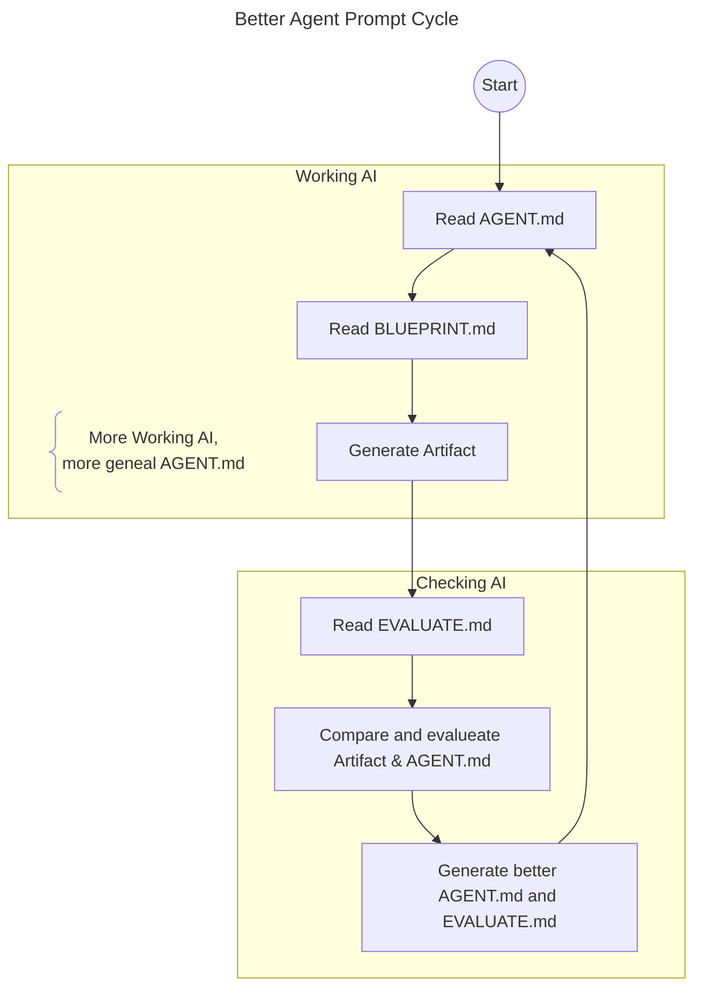

# agent-prompt

## Architecture

```mermaid
---
title: Better Agent Prompt Cycle
---
flowchart TD


Start@{ shape: circle} --> a[Read AGENT.md]
subgraph Working AI
comment@{ shape: comment, label: "More Working AI,\nmore geneal AGENT.md"}
a --> b[Read BLUEPRINT.md]
b --> c[Generate Artifact]
end

subgraph Checking AI
c --> d[Read EVALUATE.md]
d --> f[Compare and evalueate Artifact & AGENT.md]
f --> g[Generate better AGENT.md and EVALUATE.md]

g --> a
end
```

